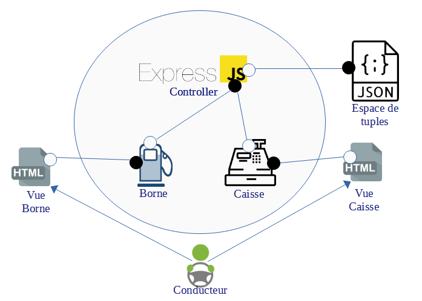

# Architecture Logicielle
### Antoine DEPOISIER & Jules FINCK

## Choix d'architecture

Pour la réalisation de ce TP, nous avons décidé d'utiliser le style architectural de type "données partagées".

<p align="center">
  
</p>

### Interactions avec l'espace de tuples

La caisse interagit avec l'espace de tuples en ajoutant les différentes commandes enregistrées.

Pour la création de ce nouveau tuple, on doit donner la quantité de carburant commandé, le carburant commandé et le code d'activation à la pompe pour pouvoir prendre le carburant.

Les pompes interagissent avec l'espace de tuple en supprimant une commande enregistrée, modifiant une commande enregistré et en lisant les spécificités de la pompe.

La seule spécificité d'une pompe, c'est le ou les types de carburant qu'elle peut délivrer. Cette information est stockée dans l'espace de tuples.

Une pompe peut complètement supprimer un tuple, quand toute la quantité de carburant a été délivrée, ou bien le modifier, en modifiant uniquement la quantité de carburant, dans le cas où le conducteur n'a pas pris tout le carburant.

### Architecture Client - Serveur

Notre architecture est aussi de type Client - Serveur.

<p align="center">
  
</p>

Le client, étant le conducteur sur le schéma, interagit par les vues HTML.

Les vues HTML peuvent communiquer avec le controller expressJS par les interfaces de la borne ou bien de la caisse.

Le controller possède différentes interfaces pour les différentes actions possibles de la borne et de la caisse.

Les vues de la caisse et de la borne envoient les commandes et la consommation des commandes par des routes d'API et le controller ajoute ces données dans l'espace de tuples.

## Réalisation

### Ajouter une commande depuis la caisse

Depuis la vue de la caisse, le conducteur peut choisir le type de carburant qu'il veut commander et la quantité souhaitée.
Lorsque la commande est effectuée, le client enverra une requête au serveur pour lui notifier qu'une nouvelle commande avec les informations données ci-dessus.

```js
function submit() {
    let body = {carburant:document.getElementById("carburant").value,
    qte:Number(document.getElementById("qte").value)}
    fetch("http://localhost:3000/code",{
        method:"POST",
        body:JSON.stringify(body),
        headers: {
            "Content-type": "application/json; charset=UTF-8"
        }
    }).then((response) => response.json()).then((json) => document.getElementById("code").innerText = json.code)
}
```

Le serveur va quant à lui créer un code pour récupérer le carburant, et ajouter dans l'espace de tuples la nouvelle commande créée.

```js
app.post('/code', (req, res) => {
    const body = req.body;
    let code = Math.floor(Math.random() * 10000);
    data.commandes.push({carburant:body['carburant'], code:code, qte: body.qte});
    writeInJSON();
    res.json({code:code});
})
```

Enfin, le serveur va envoyer au client le code généré pour la commande.

### Choix de la borne

Quand le client est sur la vue de la borne, il doit choisir sa caisse.

```js
function choixCaisse() {
    let req = new XMLHttpRequest()
    req.addEventListener("load", (s) => {
        let res = JSON.parse(req.responseText)
        document.getElementById("carburant").innerText = res.data
        document.getElementById("borne").style["display"] = "block"
    });
    req.open("GET", "http://localhost:3000/borne/" + document.getElementById("choixCaisse").value);
    req.send();
}
```

Pour chaque numéro de caisse choisi, le serveur envoie au client les spécificités de la caisse, c'est-à-dire les carburants disponibles sur cette borne.

```js
app.get('/borne/:id', (req, res) => {
    let index = req.params.id;
    res.json({data:data.bornes[index-1]});
})
```

Pour savoir les spécificités de la borne, le serveur interagit avec l'espace de tuple, mais uniquement en lecture.

### Prendre le carburant à une borne

Pour prendre le carburant à une borne, le conducteur doit entrer son code et la quantité de carburant souhaité, ce qui envoie une requête au serveur ensuite.

```js
function submit() {
    let code = Number(document.getElementById("code").value)
    let qte = Number(document.getElementById("qte").value)
    let born = Number(document.getElementById("choixCaisse").value)
    let body = {code:code, qte:qte, born:born}
    fetch("http://localhost:3000/commande",{
        method:"POST",
        body:JSON.stringify(body),
        headers: {
            "Content-type": "application/json; charset=UTF-8"
        }
    }).then((response) => response.text()).then((txt) => document.getElementById("result").innerText = txt)
}
```

Quant au serveur, il doit traiter la requête du client pour savoir si ce qu'il demande est réalisable.

Tout d'abord le serveur va regarder la commande renseigné par le client selon le code donné.

```js
app.post('/commande', (req, res) => {
    const body = req.body;
    let index = -1;
    for (let i = 0; i < data.commandes.length; i++) {
        if (data.commandes[i].code == body.code) {
            index = i;
            break;
        }
    }
```

Si le code renseigné n'existe pas, le serveur renvoie un message d'erreur.

```js
 if (index == -1) {
    res.status(400).send('Code invalide');
}
```

De même si la caisse choisie ne contient pas le carburant de la commande.

```js
else if (!data.bornes[body.born - 1].includes(data.commandes[index].carburant)) {
    res.status(400).send('Carburant indisponible dans la borne');
}
```

Enfin, si le code est valide et que la borne contient le carburant, le serveur supprime le tuple si la quantité de carburant souhaité est supérieure à la quantité renseignée sur la commande.

```js
else if (body.qte >= data.commandes[index].qte) {
    let qte = data.commandes[index].qte;
    data.commandes.pop(index);
    res.send('Les ' + qte + 'L restant on été prélevé. Code detruit');
}
```

Sinon, le serveur modifie juste le tuple en soustrayant la quantité prélevé.

```js
else {
    data.commandes[index].qte -= body.qte;
    res.send('Plein fait. Il reste ' + data.commandes[index].qte + ' sur ce code');
}
```

## Conclusion

Pour conclure, nous pouvons voire que la spécificité d'une architecture logicielle est toute simple lors de sa pensée, mais peut être beaucoup plus complexe lors de sa réalisation.

Nous avons pu apprendre que la gestion des responsabilités de chaque partie d'une architecture est importante et qu'un espace de tuples permet de simplifier grandement ces responsabilités, en ajoutant seulement un acteur à l'architecture et pour autant sans la complexifier.
