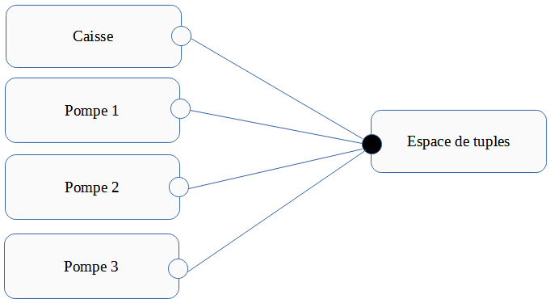

# Architecture Logicielle
### Antoine DEPOISIER & Jules FINCK

## Choix d'architecture

Pour la réalisation de ce TP nous avons décidé d'utiliser le style architectural de type "données partagées".

  

Notre porjet a aussi un semblant de l'achitecture Vue - Controller

## Intéractions avec l'espace de tuples

La caisse intéragit avec l'espace de tuples en ajoutant les différentes commande enregistrées.

Pour la création de ce nouveau tuple, on doit donner la quantité de carburant commandé, le carburant commandé et le code d'activation à la pompe pour pouvoir prendre le carburant.

Les pompes intéragissent avec l'espace de tuple en supprimant une commande enregistrée, modifiant une commande enregistré et en lisant les spécificités de la pompe.

La seule spécificité d'une pompe, c'est le ou les types de carburant qu'elle peut délivrer. Cette information est stockée dans l'espace de tuples.

Une pompe peut completement supprimer un tuple, quand toute la quantité de carburant a été délivrée, ou bien le modifier, en modiafiant uniquement la quantité de carburant, dans le cas où le conducteur n'a pas pris tout le carburant.

## Réalisation

mettre du code